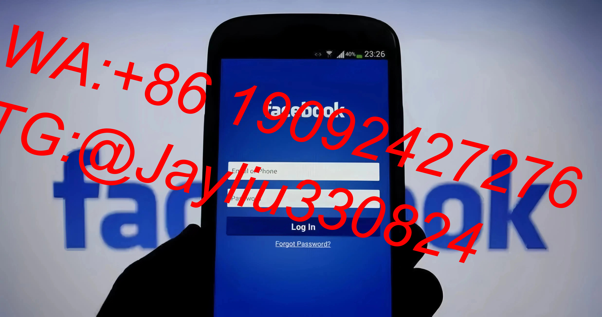

# Facebook广告智能优化体系：动态创意与版位组合策略

---

## 一、智能内容生产系统
### 1.1 创意组合策略
**基础制作规范**
- 采用3种核心视觉模板：
  ▸ 痛点解析型（占比40%）
  ▸ 功能演示型（占比35%）
  ▸ 用户证言型（占比25%）
- 每个创意组包含：
  → 主视觉（1080×1080）
  → 15秒短视频摘要
  → 交互式参数对比卡

**动态更新机制**
- 每日18:00自动生成3组文案变体
- CTR连续4小时低于0.8%暂停素材
- 完播率<20%触发字幕增强模块

---

## 二、多版本测试策略
### 2.1 四阶测试矩阵
| 测试阶段   | 广告组配置           | 评估指标            | 优化动作触发条件       |
|------------|----------------------|---------------------|------------------------|
| 冷启动     | 5个兴趣词+相同素材   | 点击成本            | CPC>$0.5强制暂停       |
| 成长       | Top2兴趣词+不同版位  | 转化率              | CVR<1.5%更换落地页     |
| 成熟       | 类似受众扩展+组合方案| ROAS                | ROAS<2启用动态优惠     |
| 衰退       | 再营销受众+新创意    | 复购率              | 衰退周期超过3天重置    |

### 2.2 版位效能优化
**黄金组合方案**
→ 移动端优先原则（预算占比65%）
→ IG快拍&信息流广告组合投放
→ Marketplace每日20:00-23:00重点投放

---

## 三、精准受众运营
### 3.1 分层运营模型
**四层管理体系**
1. 新客获取层（0转化用户）
   → 兴趣词+系统推荐受众
2. 潜客培育层（加购未转化）
   → 网站行为定向+类似受众
3. 高意向层（视频互动>75%）
   → 动态商品广告+限时优惠
4. 忠诚用户层（复购2次+）
   → VIP专属权益+裂变激励

### 3.2 再营销配置方案

① 创建网站访客自定义受众（过去30天）
② 设置动态商品广告系列（预算占比25%）
③ 配置跨设备召回规则（FB+IG+Messenger）
④ 添加专属优惠代码组件（有效期48小时）

---

## 四、数据监控与优化
### 4.1 实时监测看板
| 核心指标     | 健康阈值       | 告警机制                   |
|--------------|----------------|----------------------------|
| CPM          | <$8            | 连续3次刷新超阈值触发暂停  |
| CTR          | >1.2%         | 每小时检测环比下降20%报警  |
| 转化成本     | <$18           | 自动切换备用落地页         |
| 页面停留时长 | >55秒          | 触发信息层级优化程序       |

### 4.2 优化工具箱
**素材保鲜功能**
- 自动提取Top20%素材特征库
- 智能生成3种优化方案：
  → 文案重组变体
  → 视觉元素重配
  → 交互组件升级
- 72小时A/B测试优胜劣汰机制

---

## 实战成果：美妆品牌优化数据
**6周运营成效**
- 获客成本降低53%
- 素材更新效率提升4.2倍
- 再营销转化率提升320%
- ROAS稳定在2.8-3.5区间
- 用户终身价值增长195%

通过动态组合"精准受众+智能创意+数据驱动"的运营铁三角，构建持续优化的广告生态体系。该方案特别适合需要高频素材更新与精细化运营的中高端消费品牌，帮助广告主实现从流量获取到价值深挖的全链路提效。
[教学视频](https://youtube.com/shorts/jSXg4JXQGIU)
